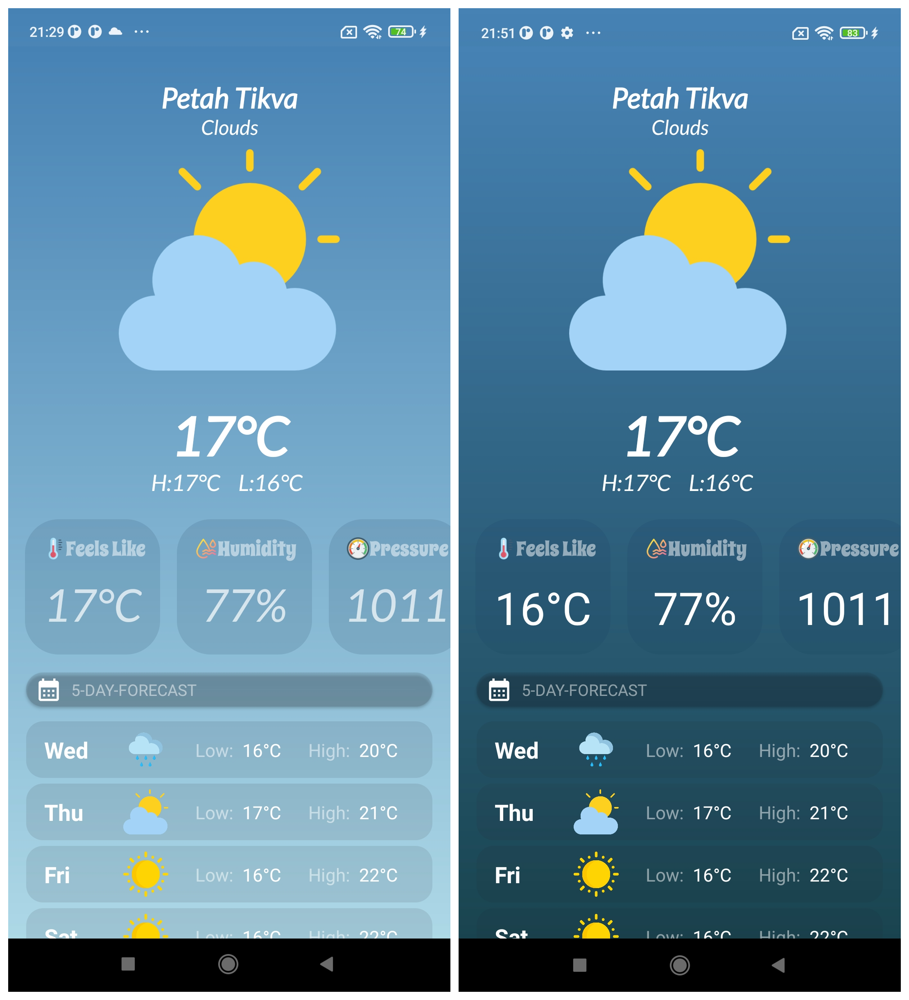
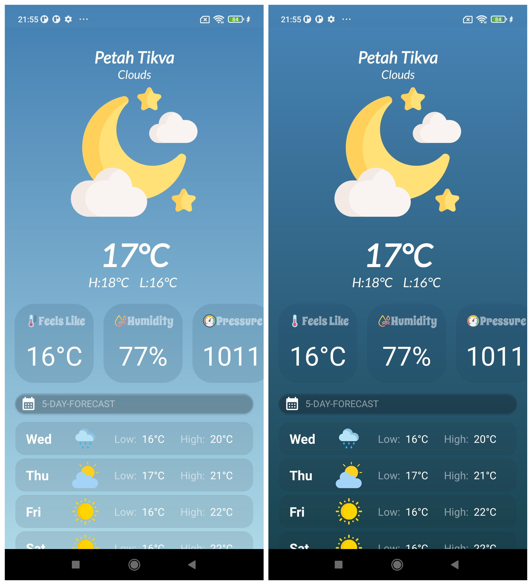
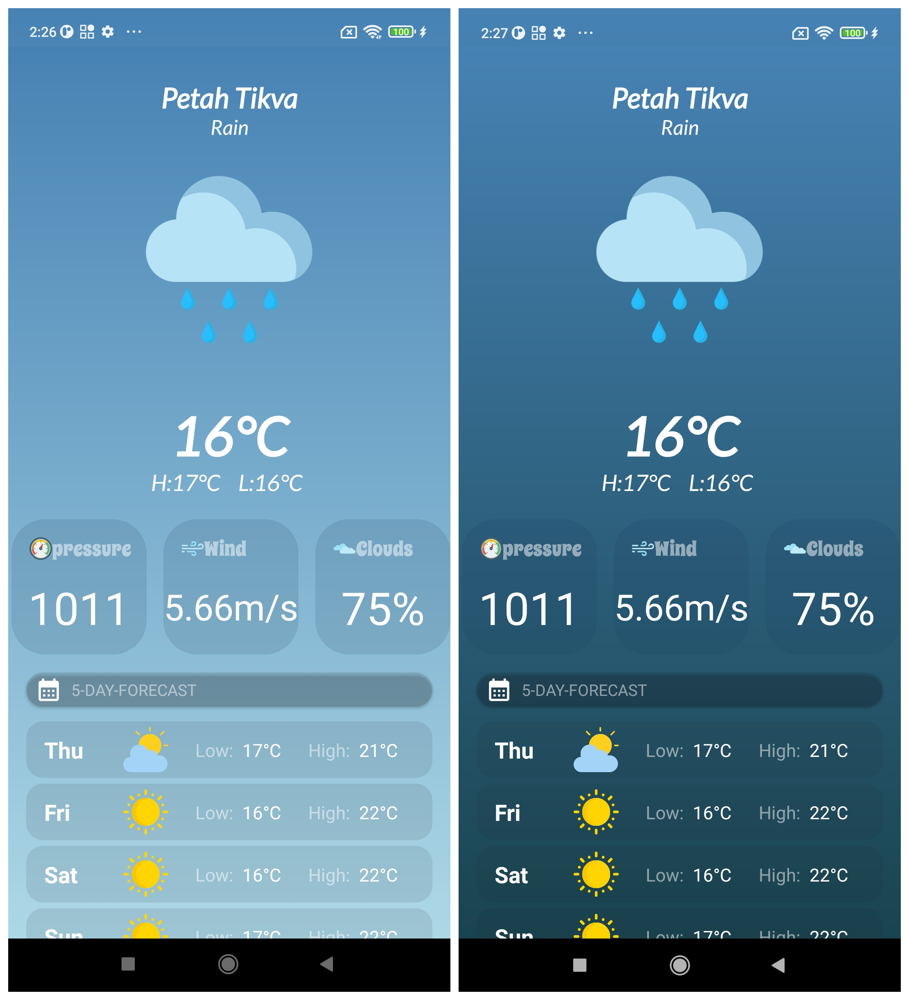
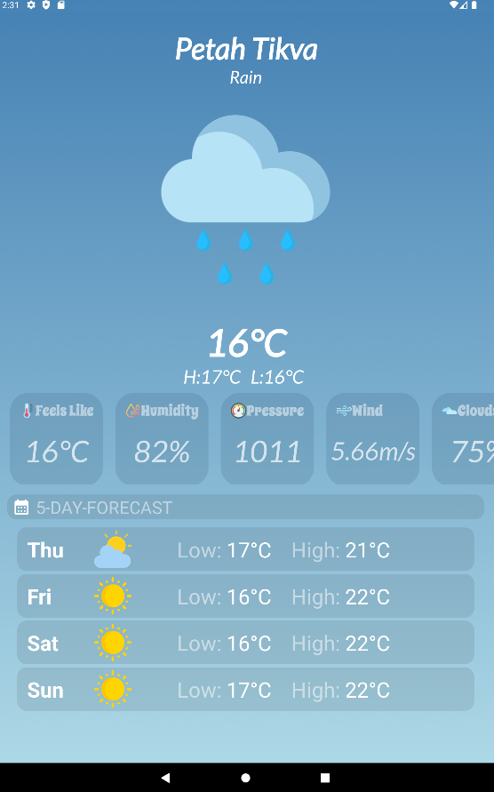

# Real-Time Weather App 

The Real-Time Weather App fetches weather data from the OpenWeatherMap API to provide users with current weather information and a 5-day forecast. The app is designed to be responsive across all screen sizes.

## Navigation Bar
- [**Features**](#features)
- [**Technologies Used**](#technologies-used)
- [**Screenshots**](#screenshots)
- [**Usage**](#usage)

## Features

- **Real Time Weather**: Fetches and displays current weather data from the OpenWeatherMap API, providing users with up-to-date weather information.

- **Responsive To All Screens**: Utilizes responsive design principles to ensure optimal user experience across various screen sizes, including phones and tablets.

- **Dark Mode**: Supports a dark theme option for improved visibility in low-light environments. has different UI in dark mode

- **Different UI At Night**: Changes weather icons to reflect nighttime conditions, providing visual cues for weather conditions during nighttime hours.

## Technologies Used
* Kotlin.
* MVVM Architecture.
* Coroutines.
* Data Binding 
* Android Architecture Components (LiveData & ViewModel) .
* Retrofit.
* Picasso.
* GSON .
* GSON Convertor.
* Coroutines.
* Responsive UI (ScrollView, RecyclerView).

## Screenshots

### Phones:

|  |  |  |
|:-------------------------------------:|:---------------------------------------:|:--------------------------------------:|

### Tablet:

## Usage

**Before Running The App**: 

you need to get an API key from OpenWeatherMap API

- 1 . Go to https://home.openweathermap.org/api_keys
- 2 . Sign In / Create Account
- 3 . Go to API keys (if you cant see it go to your profile -> My Api Keys)
- 4 . Copy the generated key

Once you obtained your API key, you can open your **local.properties** file in your project's top level folder, and add the following line in it:

**Add to local.properties:**

    WEATHER_API_KEY = "YOUR_API_KEY"

- Make sure your emulator/device is connected and recognized by Android Studio.
- Click the "Run" button in Android Studio to build and launch the app.
- The app will load a real time weather information.

### Thank You For The Opportunity 

